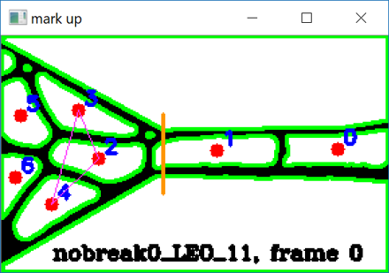
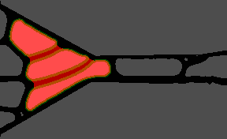

# TangDropletAnalysis

Some analysis tools written in python for extacting frames and features from videos of droplets entering a constriction. Note the current code is for already preprocessed, binary videos. See the write_all_frames_to_dictionary.py code for notes on setting up your working directory.

## Just some figures...
Marked-up frame:  

Combining contour frame:  

### Stay tuned for code to preprocess videos and more!
